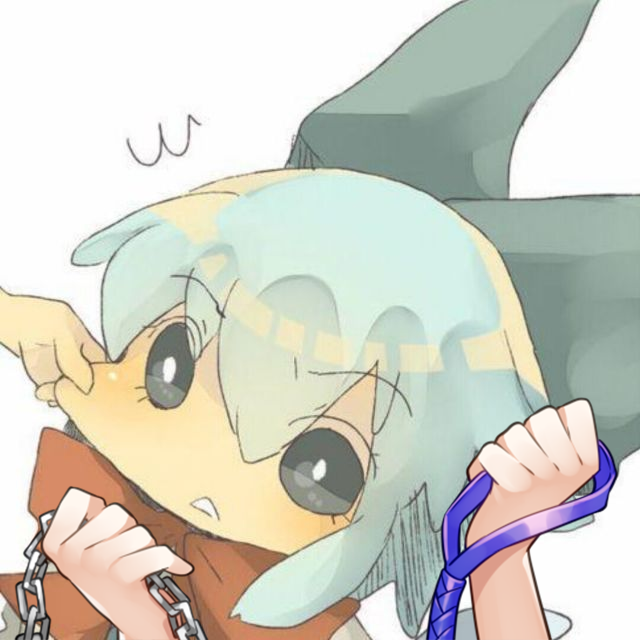
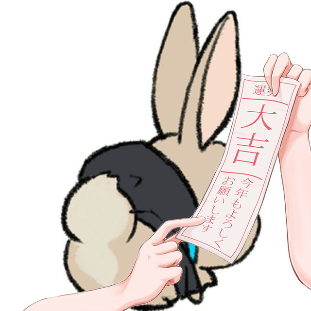
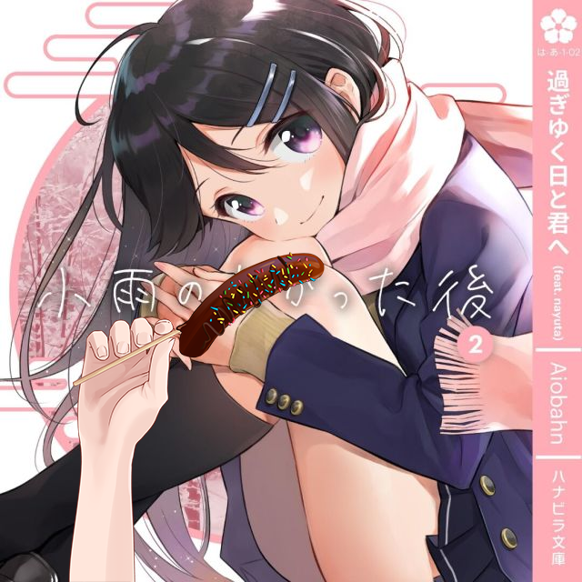

# dailyWife

一个每天定时挑选群友进行迫害的 Mirai 插件

## 工作原理

每天 `00:00` 开始捕捉群友

(每个群友发消息有 `10%` 的概率被捕捉)

被捕捉后会成为大家今天的 ~~rbq~~迫害对象

每次发送 `wife` 都会将迫害贴图与迫害对象头像叠加

## 使用方法

1. 下载 [最新版本](https://github.com/Dituon/dailyWife/releases/)

2. 将插件放入 `Mirai/plugins/`

3. 下载 [图片素材](https://github.com/Dituon/dailyWife/tree/main/res/wife)

4. 将图片素材放入 `Mirai/res/wife`

5. 启动 Mirai, 等待群友被捕捉

## 图片预览

展开/收起

## 贴图来源

**如有侵权，请联系我删除**

**If I violate your rights, please contact me to delete**

**私があなたの権利を侵害した場合は、削除するために私に連絡してください**

展开/收起

[twitter](https://twitter.com/emp04510/status/1473986440216596485)

[twitter](https://twitter.com/arainekozz/status/1476712204812488706)

[twitter](https://twitter.com/iori_to1/status/1476079146958979075)

[twitter](https://twitter.com/noplan_kuroma/status/1465317134473449480)

[twitter](https://twitter.com/aoihawaii/status/1513088061105930240)

[twitter](https://twitter.com/traim_kb/status/1471127974032609281)

[twitter](https://twitter.com/mamiya_mao/status/1415593570262609920)

[twitter](https://twitter.com/mamiya_mao/status/1415203439986892802)

[booth.pm](https://booth.pm/ja/items/3105893)

